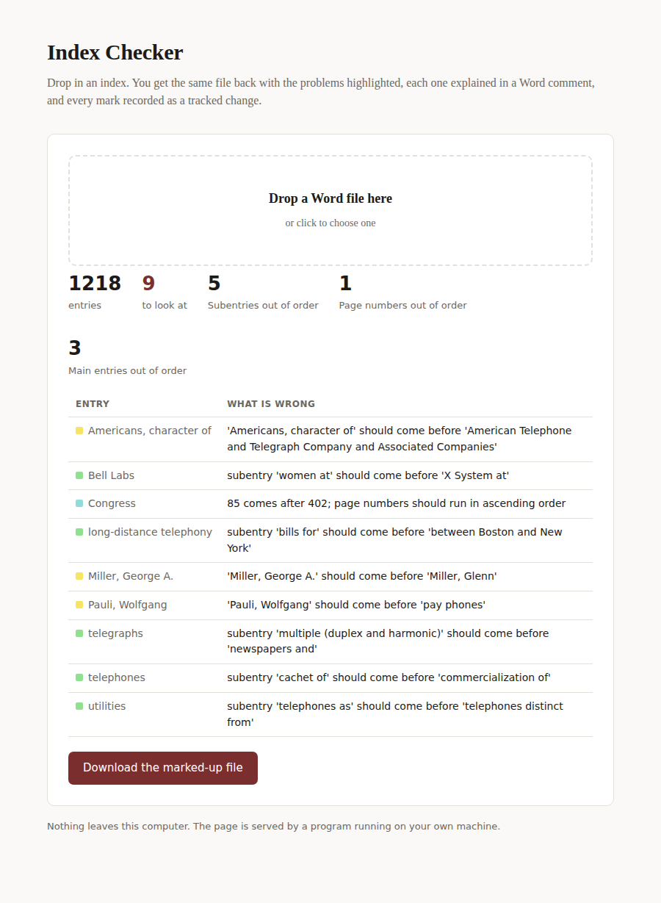

# Index Checker

Checks a book index against FSG house style. You drop the Word file onto a page
and get the same file back with the problems highlighted, each one explained in
a Word comment, and every mark recorded as a tracked change — so nothing the
checker does can be left in the file by accident.



---

## What it does

**Fixes, as tracked changes** — only where house style settles the question:

* page ranges elided as §9 wants them (`308–310` → `308–10`)
* hyphens and em dashes between page numbers turned into en dashes
* note markers and their note numbers italicised (§17)
* `see` and `see also` lowercased and italicised (§15)
* straight quotes turned into curly ones
* tabs removed, runs of spaces closed up

**Flags, highlighted and explained in a comment** — where it needs your
judgement:

| Check | Highlight |
|---|---|
| Main entries out of alphabetical order | yellow |
| Subentries out of alphabetical order | green |
| Page numbers out of order, or listed twice | blue |
| Page ranges that run backwards, or run past the end of the book | pink |
| Doubled punctuation, or an entry ending in it | yellow |
| A comma or semicolon that should be roman, not italic | green |
| A personal title spelled out rather than abbreviated | yellow |
| `ff.`, `passim`, spaced dashes, lines with no entry term | pink |
| A `see` or `see also` pointing at an entry that does not exist | pink |
| Punctuation between the parts of an entry (§12, §15, §16) | yellow |

A flag is either an **error** — wrong however you read it — or a **check**,
meaning it breaks the house rule but would be right under another defensible
reading. The comment says which.

Alphabetising is letter by letter, per §5 of the FSG Indexing Guidelines: it
ignores spaces, punctuation and accents, and everything after an open
parenthesis, comma or colon. Because that makes `New, Arthur` and `New, James`
identical, a second key breaks the tie on the given name, with abbreviated
personal titles ignored as §7 requires.

[`docs/RULES.md`](docs/RULES.md) records the judgement calls behind every rule;
[`docs/FEASIBILITY.md`](docs/FEASIBILITY.md) covers the whole wish list and
what is left.

## How the marks work

Every mark is a tracked change, so in Word:

* **Reject All** puts the file back exactly as it arrived — fixes and
  highlights alike. This is checked on every run against all three sample
  indexes, paragraph for paragraph.
* **Accept All** would keep the highlights as well as the fixes, which you do
  not want. Work through the changes one at a time: accept the fixes you agree
  with, and reject each highlight once you have dealt with it.

Every highlight carries a comment saying what is wrong, so you never have to
work out why something was flagged.

---

# Setting up

**You only do this once.** After that, checking an index is drag, drop,
download.

## Step 1 — Is Python already there?

**On a Mac:** press `⌘ + Space`, type `Terminal`, press Enter, then type:

```
python3 --version
```

**On Windows:** press Start, type `Command Prompt`, press Enter, then type:

```
python --version
```

If you see something starting with `3.` (3.9 or higher), skip to Step 2.
If you see `command not found` or `not recognized`, install Python from
**https://www.python.org/downloads/** first.

> On Windows, tick **"Add python.exe to PATH"** at the bottom of the installer
> before clicking Install. It is the easiest step to miss and the one that
> breaks everything else.

## Step 2 — Download the tool

On the project's GitHub page, click the green **Code** button, choose
**Download ZIP**, and unzip it somewhere you will remember — Documents is fine.

## Step 3 — Open it

* **On a Mac:** double-click **`run-checker.command`**
* **On Windows:** double-click **`run-checker.bat`**

The first time, it spends a minute setting itself up. Then a page opens in your
browser. Leave the small black window open while you use it — that is the
program itself. Closing it closes the checker.

> **Mac, first time only:** if you get "cannot be opened because it is from an
> unidentified developer", right-click `run-checker.command`, choose **Open**,
> then **Open** again. You only do this once.

The checker keeps its Python setup in your own user folder rather than beside
these files, so it works whether you keep this folder on your computer or on a
shared network drive.

### If it stops after "Setting up for the first time"

You may see something like:

```
Actual environment location may have moved due to redirects, links or junctions.
  Requested location: "I:\...\.venv\Scripts\python.exe"
  Actual location:    "\\NYFILE32\FSGCommon\...\.venv\Scripts\python.exe"
```

That is an older version of this tool trying to set itself up on a network
drive, which Windows will not allow. Download the current version and it will
work from the network drive. If you would rather not download it again, copying
the folder to your Desktop also fixes it.

## Step 4 — Check an index

Drag the Word file onto the page. If you fill in the last page of the book
first, it will also catch references pointing past the end. You get a list of
what was fixed and what was flagged, and a **Download the marked-up file**
button.

Nothing leaves your computer. The page is served by the program running on your
own machine.

---

## For the terminal, if you prefer

```
indexcheck check index.docx                 # writes index_checked.docx
indexcheck check index.docx --last-page 460 # also catch pages past the end
indexcheck check index.docx --dry-run       # just report, write nothing
indexcheck rules                            # list the checks and their colours
indexcheck ui                               # open the drag-and-drop page
```

## Running the tests

```
python -m venv .venv
.venv/bin/pip install -e ".[dev]"
.venv/bin/python -m pytest
```
